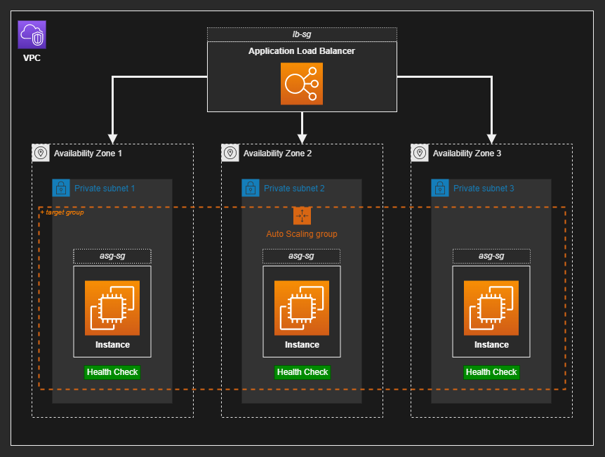

# AWS EC2 HA Cluster

High-availability EC2 cluster provisioned with Terraform.



## 1 - Create the base instance & infrastructure

Start by creating a temporary key pair:

```sh
ssh-keygen -f ./tmp_rsa
```

Create the base infrastructure:

```sh
terraform -chdir="ami" init
terraform -chdir="ami" apply -auto-approve
```

The Apache instance should be available on port 80.


## 2 - Create the AMI

This instance is not encrypted, so create an encrypted snapshot:

```sh
# List the volumes
aws ec2 describe-volumes

# Create a snapshot
aws ec2 create-snapshot --volume-id 'vol-0123456789abcdef' --description 'Unencrypted' --tag-specifications 'ResourceType=snapshot,Tags=[{Key=Name,Value=Unencrypted}]'

# Make an encrypted copy of a snapshot
aws ec2 copy-snapshot \
  --source-region 'sa-east-1' \
  --source-snapshot-id 'snap-0123456789abcdef' \
  --description 'Encrypted' \
  --encrypted \
  --kms-key-id '00000000-0000-0000-0000-000000000000'
```

Now. create the image from the snapshot:

```sh
aws ec2 register-image \
	--name "ec2ha-encrypted" \
	--region='us-east-2' \
	--description "AMI_from_snapshot_EBS" \
	--architecture arm64 \
	--virtualization-type hvm \
	--block-device-mappings 'DeviceName=/dev/sda1,Ebs={SnapshotId=snap-00000000000000000}' \
	--root-device-name "/dev/sda1"
```

The image should now be available to be used for new launches.

Optionally, creating an image directly from a running instance is possible:

```sh
aws ec2 create-image \
  --instance-id i-1234567890abcdef0 \
  --name "My server" \
  --description "An AMI for my server"
```

Copy the AMI ID to use when creating the cluster.

## 3 - EC2 launch without KMS permissions

To simulate the permission issue, login with the `ec2launcher` IAM user and launch an instance.

This user doesn't have KMS permissions, and the launch should fail due to that. Immediately after launching, the instance will go to `Shutting-down` state and terminate.

💡 For the auto scaler, [special permissions][1] are required and implemented into the Terraform recipe.


## 4 - Create the HA cluster

Create the `cluster/.auto.tfvars` file that points to the AMI:

```terraform
ami_id      = "ami-0123456789abcdef"
kms_key_arn = "00000000"
```

Create the EC2 cluster:

```sh
terraform -chdir="cluster" init
terraform -chdir="cluster" apply -auto-approve
```

💡 As explained earlier, [KMS permissions][1] are granted to the AWS account Autoscaling role to access the KMS-encrypted AMI.

You should now be able to access the Apache server using the balancer URL:

```sh
curl http://ec2ha-lb-0123456789.sa-east-1.elb.amazonaws.com
```

---

### Clean-up

Destroy the resources:

```sh
terraform -chdir="cluster" apply -auto-approve
terraform -chdir="ami" apply -auto-approve
```

Delete the volumes and images created.

[1]: https://docs.aws.amazon.com/autoscaling/ec2/userguide/key-policy-requirements-EBS-encryption.html#policy-example-cmk-access
